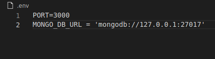

## API Rest de um sistema Todo list em Node.JS :desktop_computer:

Olá seja bem vindo ao repositorio do projeto API todo list (lista de afazeres). :rocket:

Este projeto consiste em uma API no padrão REST de uma aplicação de lista de afazeres,
esta API e consumida por um front-end em React. Utilizei a arquitetura `MSC` para construir esta api, de forma que sua `manutenção e adição de novas funcionalidades` ficam mais faceis de se implementar.

Sua estrutura interna de arquivos esta dividida por `papel técnico`.

Fique a vontade para contribuir, será um prazer interagir com você!

## Estrutura

**`MSC`** - MODEL, SERVICES e CONTROLLERS

1. Pasta model é responsável por toda interface com banco de dados, query's, conexão etc.

2. Pasta Services se concentra toda regra de negócio e chamadas ao banco de dados.

3. Pasta Controllers se dedica apenas para receber requisições e direcionar ao services, e por
    consequência receber as respostas e repassar para rotas da aplicação.

4. Pasta Schemas ficam todas as validações da aplicação, ex: regex de email etc.

5. Pasta de middlewares ficam os middlewares, mais especifico neste projeto middleware de erro.

6. Pasta routers contém as rotas da aplicação.

7. Pasta public/imgs contém as imagens utilizadas no projeto.

## tecnologias utilizadas

- Linguagens:
  - NodeJs
- Database: 
  - Mongodb
- Tratamento de erros:
  - hapi/boom
  - express-rescue
  - joi
- Configurações
  - Dotenv
- Organização e Padronização de codigo:
  - Eslint / config-airbnb-base
- Facilitador de desenvolvimento:
  - nodemon
- framework's:
  - Express

## Começando

#### Para executar o projeto, será necessário ter instalado:

1. [MongoDB](https://www.mongodb.com/try/download/community) banco utilizado para o desenvolvimento
2. [Insomnia](https://insomnia.rest/download) para fazer requisições nas rotas da API. (ou qualquer outro para testes de API)
3. [NodeJS](https://nodejs.org/en/) Este projeto necessita do NodeJs instalado em seu computador para rodar localmente.

#### proximos passos

- Clone o repositório `git clone git@github.com:clebertonf/Projeto-API-REST-todo-list.git`
- Na raiz do projeto rode o comando **npm install** para instalar as depedências do projeto.

## Configuracão

Crie um arquivo com nome **`.env`** na raiz do projeto, dentro deste arquivo adicione as seguintes variáveis de ambiente:

1. `PORT`=3000
2. `MONGO_DB_URL` = 'mongodb://127.0.0.1:27017'

## Executando API

Verifique o `package.json`, la se encontram scripts para execução do projeto.

- `"debug": "nodemon index.js",`  (`npm run dev`) inicia o projeto com nodemon.
- `"start": "node index.js",` (`npm start`) inicia o projeto com  node.

## Após todos os passos execute npm run dev na raiz para iniciar o projeto.