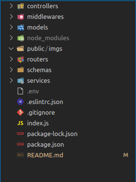

## API Rest de um sistema Todo list em Node.JS :desktop_computer:

Olá seja bem vindo ao repositorio do projeto API todo list (lista de afazeres). :rocket:

Este projeto consiste em uma API no padrão REST de uma aplicação de lista de afazeres,
esta API e consumida por um front-end em React. Utilizei a arquitetura `MSC` para construir esta api, de forma que sua `manutenção e adição de novas funcionalidade`s ficam mais faceis de se implementar.

Sua estrutura interna de arquivos esta dividida Por `papel técnico`.

Fique a vontade para contribuir, será um prazer interagir com você!

## Estrutura

**`MSC`** - MODEL, SERVICES e CONTROLLERS

1. Pasta model é responsável por toda interface com banco de dados, query's, conexão etc.

2. Pasta Services se concentra toda regra de negócio e chamadas ao banco de dados.

3. Pasta Controllers se dedica apenas para receber requisições e direcionar ao services, e por
    consequência receber as respostas e repassar para rotas da aplicação.

4. Pasta Schemas ficam todas as validações da aplicação, ex: regex de email etc.

5. Pasta de middlewares ficam os middlewares, mais especifico neste projeto middleware de erro.

6. Pasta routers contém as rotas da aplicação.

7. Pasta public/imgs contém as imagens utilizadas no projeto.

